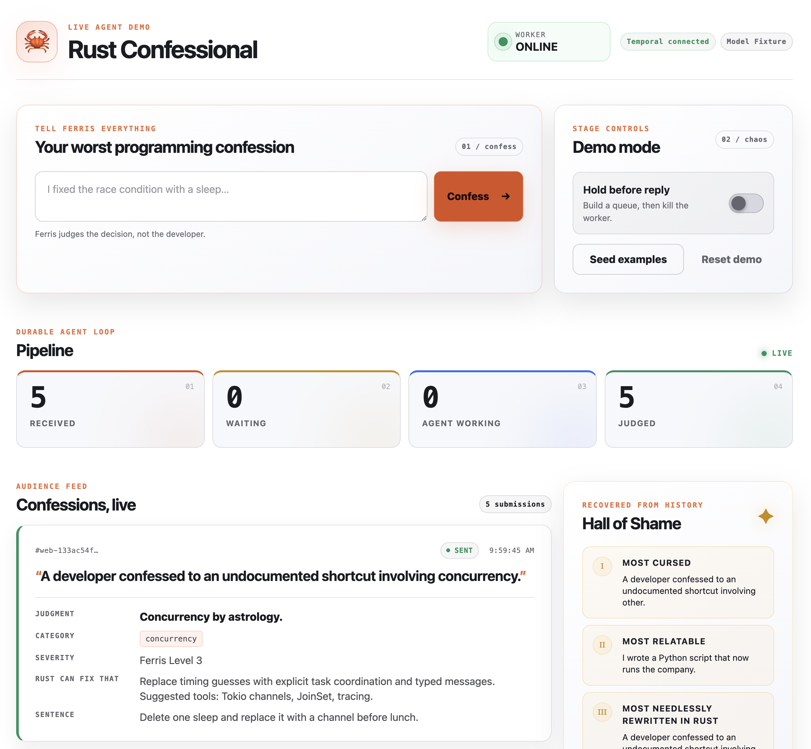

# Rust Confessional

A stage-friendly Rust and Temporal demo: audience members submit a programming
confession, Ferris plans a response, consults an approved Rust remedy catalog,
and produces a dry but useful judgment. The dashboard makes every transition
visible. Kill the Worker at the controlled checkpoint, release the replies while
it is offline, restart it, and watch Temporal resume the agent.



The talk-sized thesis is:

> Rust makes the agent loop explicit. Temporal makes its progress survive.

This repository is intentionally Docker-first. You do not need Rust, Cargo, or
Temporal installed on the host.

## What is included

- A tiny in-memory `naive` agent for the opening failure contrast
- A Rust/Axum stage server and live browser dashboard
- One Temporal Workflow per confession (production shape), with a dashboard
  toggle to an aggregate one-Workflow-per-session mode that makes durable state
  vivid on stage
- Typed Activities for planning, remedy lookup, composition, projection, and
  delivery
- A deterministic fixture model for rehearsals and offline stage use
- An optional OpenAI Responses API backend with structured JSON output
- An optional signed Twilio inbound-message webhook
- A safe-by-default stage feed using the agent's display paraphrase, plus an
  explicit trusted-input switch for showing incoming text immediately
- A deliberate `Reply Pending` checkpoint and durable `release` Signal
- A dry, model-written `penance` rendered on the dashboard as a loop that types
  itself out, repeated by severity
- Three stage failure beats — a transient model rate-limit that Temporal retries
  and heals, a network partition, and a Worker crash — contrasting Temporal's
  high-level reliability with Rust's low-level reliability
- Persistent Docker volumes for Temporal history and the dashboard projection
- Three score-based “Hall of Shame” awards, selected only from `Sent` rows

Audience input can come from the local browser form or the optional Twilio
webhook. Twilio support is inbound-only: the demo delivery Activity reports back
to the stage and does not send an SMS reply.

## Quick start

Prerequisites:

- Docker Engine or Docker Desktop with Docker Compose v2
- Loopback ports `3000`, `7233`, and `8233` available
- Network access for the first image pull and Rust dependency build

The official native Temporal Rust SDK is Public Preview at the version used
here, and its APIs may evolve. Every `temporalio-*` crate is intentionally pinned
to exactly `=0.5.0`, with `Cargo.lock` committed; treat upgrades as deliberate
code and replay-compatibility work.

Start in fixture mode, which is the safest mode for a live presentation:

```sh
make up
make status
curl -fsS -o /dev/null http://localhost:3000/healthz
```

Open:

- Stage dashboard: <http://localhost:3000>
- Temporal Web UI: <http://localhost:8233>

The dashboard starts with **Hold before reply** enabled. Submit a confession,
wait for `Reply Pending`, then turn the hold off to let it finish. While the
agent is working, the default public card shows a neutral placeholder; it is
replaced by the agent's `display_confession` only when the structured judgment
arrives.

Stop the containers while retaining both named volumes:

```sh
make down
```

See [the demo runbook](docs/DEMO_RUNBOOK.md) for the exact kill, offline
release, and restart sequence.

## Opening beat: the naïve agent forgets

The runtime image also contains a deliberately non-durable agent. It uses the
fixture backend, builds one judgment, and holds the pending reply only in process
memory. Run it after `make build` or `make up`.

Terminal A (this command intentionally stays attached):

```sh
make naive-run
```

Wait for:

```text
REPLY PENDING  memory only — kill this container now
Pending confessions in this process: 1
```

Then, in Terminal B:

```sh
make naive-forget
```

Terminal A exits because its container received `SIGKILL`; a non-zero Make exit
is expected. Back in Terminal A, simulate restarting the agent:

```sh
make naive-restart
```

It reports:

```text
Recovered pending confessions: 0
Nothing to resume—the process memory is empty.
```

That is the short opening contrast. The main demo below kills only the Temporal
Worker and recovers the same pending work.

## Stage feed safety mode

`SHOW_RAW_CONFESSIONS=false` is the default and the recommended setting for a
public event. Stage stores and serves a neutral placeholder followed by the
agent's stage-safe paraphrase. The raw confession still exists in Temporal
history and, in OpenAI mode, is sent to the model provider.

For a rehearsal or a presenter-controlled set of trusted inputs, raw display can
be explicitly enabled:

```sh
export SHOW_RAW_CONFESSIONS=true
docker compose up -d --force-recreate stage
```

In this mode Stage removes control characters and collapses whitespace (keeping
letters, numbers, punctuation, and emoji), blanks any words listed in the
optional `MASK_WORDS` environment variable, immediately projects the result,
persists it in the `stage-data` volume, and keeps it instead of replacing it with
`display_confession`. Submissions that are empty once control characters are
removed are rejected. No word list is bundled in this repository; supply your own
via `MASK_WORDS` (a comma- or space-separated list kept in your git-ignored `.env`).
These guards raise the floor; they are not human moderation and cannot catch
creative spellings, context, or personal information such as names or phone
numbers. Keep a presenter kill switch (the Hold toggle and Reset) ready and
rehearse with real inputs before allowing open audience input or a public Twilio
number.

Stage fails closed if Twilio is configured at the same time as raw display. It
will start only if `ALLOW_UNMODERATED_TWILIO=true` is also explicit. That escape
hatch exists for controlled integration testing, not public events; prefer
disabling Twilio or keeping raw display off.

To return to the safe default and clear the current Stage projection:

```sh
export SHOW_RAW_CONFESSIONS=false
export ALLOW_UNMODERATED_TWILIO=false
docker compose up -d --force-recreate stage
make reset-demo
```

Changing the flag does not retroactively scrub rows already persisted. Temporal
history retains raw Workflow input and the plan/compose Activity inputs in
either mode. The lookup Activity receives only the typed plan, and delivery
receives only the submission ID, so raw text is not copied into those payloads.

## Model modes

### Fixture mode (recommended on stage)

Fixture mode is the default:

```sh
MODEL_PROVIDER=fixture docker compose up --build -d
```

It performs keyword-based classification, uses the bundled remedy catalog, and
adds short simulated delays so the pipeline remains visible. Its outputs are
repeatable and it makes no model network calls. The Docker image must still be
built or pulled before an offline event.

### OpenAI mode

OpenAI mode makes two structured-output requests per confession: one to plan
and one to compose. Supply a model that your account can access. To avoid
putting the API key itself in shell history:

```sh
export MODEL_PROVIDER=openai
read -rsp "OpenAI API key: " OPENAI_API_KEY; export OPENAI_API_KEY; echo
export OPENAI_MODEL="YOUR_MODEL_ID"
docker compose up --build -d
```

The configured default model is visible in `compose.yaml`, but setting
`OPENAI_MODEL` explicitly is recommended because model availability varies by
account. Requests use the Responses API, strict JSON schemas, a 12-second
default HTTP timeout, and `store: false`.

To switch an already-running stack back to the fixture backend:

```sh
export MODEL_PROVIDER=fixture
unset OPENAI_API_KEY
docker compose up -d --force-recreate worker
```

This changes future Activity execution; it does not reopen a Workflow that has
already failed after exhausting its retries.

## Optional inbound SMS (Twilio)

Twilio ingress is disabled unless all three variables below are set. The webhook
URL must be the exact external URL Twilio invokes, including scheme, host, path,
port, and any query string; that exact value is part of signature validation.
Keep `SHOW_RAW_CONFESSIONS=false` for a public Twilio number.

```sh
export TWILIO_ACCOUNT_SID="AC..."
read -rsp "Twilio auth token: " TWILIO_AUTH_TOKEN; export TWILIO_AUTH_TOKEN; echo
export TWILIO_WEBHOOK_URL="https://YOUR_PUBLIC_HOST/webhooks/twilio/messages"
export SHOW_RAW_CONFESSIONS=false
export ALLOW_UNMODERATED_TWILIO=false
docker compose up -d --force-recreate stage
```

Configure the inbound message webhook for the demo number to send an HTTP
`POST` to the same `TWILIO_WEBHOOK_URL`.

Compose publishes Stage only on loopback. Use a path-restricted HTTPS reverse
proxy that forwards only `/webhooks/twilio/messages` to
`http://127.0.0.1:3000/webhooks/twilio/messages`. Do not use a whole-service
tunnel: it would also expose the unauthenticated hold, seed, and reset controls.

The endpoint requires `application/x-www-form-urlencoded`, validates
`X-Twilio-Signature` and `AccountSid`, and uses `MessageSid` as the stable
submission identity. It requires `From` and `To` for request validation but does
not retain or log those phone numbers. Standard STOP/START/HELP-family command
messages are acknowledged without starting Workflows.

The response is empty TwiML. There is no outbound Twilio API call and no SMS
judgment; results appear on the stage dashboard. An unsigned request is rejected.

## Failure modes to demo

The demo shows reliability at two layers, and each beat exercises one:

- **Temporal (high-level):** durable retries with backoff, Activity timeouts,
  at-least-once Task redelivery, and Workflow state that survives crashes and
  partitions.
- **Rust (low-level):** typed retryable-versus-permanent errors, bounded HTTP
  timeouts, and a Worker that reconnects cleanly, all checked by the compiler.

Three beats, escalating from a recoverable glitch to outright process death.
Full speaker cues and fallbacks are in
[docs/DEMO_RUNBOOK.md](docs/DEMO_RUNBOOK.md).

### 1. Transient model failure (rate-limit or downtime)

Submit a confession that mentions rate limiting, for example
"the API keeps rate-limiting my agent". The `compose` Activity returns a
*retryable* error on its first two attempts and succeeds on the third, keyed on
the Activity's own attempt counter. The card stays in `Composing` while Temporal
retries with backoff (the attempts are visible in Temporal Web), then recovers
with no operator action. Rust decides the error is retryable; Temporal owns the
backoff and keeps the Workflow durable. This works in both fixture and OpenAI
mode.

### 2. Network partition

```sh
make partition-worker
make heal-worker
```

`partition-worker` disconnects the Worker container from the Compose network, so
the process keeps running but cannot reach Temporal (or Stage). Workflows make no
progress and lose nothing; `heal-worker` reconnects it and Temporal redelivers
the pending Tasks so execution resumes. This is distinct from a crash: the
process never died, it was only isolated.

### 3. Worker crash and recovery

Keep replies held, submit or seed confessions, and wait until they show
`Reply Pending`. Then run:

```sh
make kill-worker
```

After about three seconds the dashboard reports the Worker offline. While it is
offline, turn **Hold before reply** off in the dashboard. Temporal accepts the
release Signal, but no Worker is available to advance the Workflow. Restart it:

```sh
make restart-worker
```

The Worker replays Workflow history and continues through `Sending` to `Sent`.
Only then do those rows become eligible for the Hall of Shame, so the awards
reveal lands after recovery. The Stage process and Temporal server stay up
throughout.

## Workflow design and best practices

### How it is built

- **One Workflow per confession.** Each submission starts its own
  `ConfessionWorkflow` with a stable, readable Workflow ID
  (`rust-confession-{session}-{submission}`). This is the idiomatic unit of work
  and scales to very large numbers of Workflows.
- **Deterministic orchestration, side effects in Activities.** The Workflow
  decides *what* happens and in what order; every model call, catalog lookup,
  status report, and delivery runs behind an Activity boundary so replay stays
  deterministic.
- **Durable in-process state.** The Workflow folds each result into its own
  state with `ctx.state_mut(...)` (plan, judgment, status, release flag). That
  state is rebuilt by replay after any failure and exposed through the `snapshot`
  query. Because a Workflow runs single-threaded and deterministic, it needs no
  locks and has no data races, and the Rust type system still guarantees it. This
  "one durable object, many calls, no locks" property is the heart of the demo.
- **Per-operation timeouts and retries.** Each Activity has an explicit
  start-to-close and schedule-to-close timeout and a retry budget; see
  `activity_options` in `src/workflows.rs`.

### Best practices worth taking away

- Model the contract between steps as **typed Rust values**, not loose strings.
- Keep **Workflow code deterministic**; push all I/O, time, and randomness into
  Activities.
- Give every side effect an **explicit timeout and retry budget**, and mark
  permanent failures non-retryable so they fail fast.
- Treat external effects as **at-least-once** and deduplicate (delivery is capped
  at one attempt until it dedupes by submission ID).
- Prefer **one Workflow per unit of work**. Temporal scales by running many
  Workflows, not by cramming requests into one. Consolidate into a per-entity,
  per-window, or per-region Workflow only when the domain needs aggregation,
  ordering, windowing, or rate-limiting, not for raw throughput. A single
  long-lived Workflow that ingests everything also needs continue-as-new for
  history growth and is where the preview Rust SDK is thinnest.
- Pin **SDK versions** and treat upgrades as deliberate replay-compatibility
  work; use **stable Workflow IDs** and **durable Signals**.

### Production vs demo: the workflow-mode toggle

The dashboard has an **Aggregate workflow** switch (and `POST /api/demo/mode`)
that flips between the two shapes so you can show the difference live:

- **Per confession (default, production):** one `ConfessionWorkflow` per
  submission. In Temporal Web you see one Workflow per confession — the shape you
  would ship.
- **Aggregate (demo):** one long-lived `SessionWorkflow` for the whole session.
  Every confession arrives by Signal and is folded into that single Workflow's
  durable state via `state_mut`, so the entire board is one durable object you
  can inspect with its `snapshot` query. In Temporal Web you see exactly one
  Workflow.

Both modes run the same Activities and report to the same dashboard; only the
Workflow granularity differs. Switching modes resets the session so the two never
interleave. Use the aggregate mode to make durable state vivid on stage; keep the
per-confession mode as the production reference.

See [docs/ARCHITECTURE.md](docs/ARCHITECTURE.md) for the full design.

## Useful commands

| Command | Purpose |
| --- | --- |
| `make up` | Build and start Temporal, Stage, and Worker in the background |
| `make down` | Stop the stack; retain named volumes |
| `make build` | Build the Docker application image |
| `make test` | Run `cargo test --locked` in the Docker test target |
| `make lint` | Run formatting checks and Clippy with warnings denied |
| `make logs` | Follow Stage and Worker logs |
| `make status` | Show Compose service state |
| `make naive-run` | Run the blocking, in-memory fixture agent in a temporary container |
| `make naive-forget` | Send `SIGKILL` to the named `naive-agent` container |
| `make naive-restart` | Start a fresh naïve process and show that zero items recover |
| `make kill-worker` | Send `SIGKILL` to only the Worker container |
| `make restart-worker` | Start the stopped Worker container |
| `make partition-worker` | Disconnect the Worker from the Compose network (simulate a network partition) |
| `make heal-worker` | Reconnect the Worker to the Compose network |
| `make reset-demo` | Pause admissions, release unfinished Workflows, wait up to 12 seconds, then start a fresh session |

For a completely clean rehearsal, including deleting both named volumes:

```sh
docker compose down -v
docker compose up --build -d
```

`down -v` permanently deletes local demo history and dashboard state. A normal
`make down` does not.

## Services and ports

| Service | Host address | Purpose |
| --- | --- | --- |
| Stage | `127.0.0.1:3000` | Dashboard, demo API, health check |
| Temporal | `127.0.0.1:7233` | Temporal gRPC endpoint |
| Temporal Web | `127.0.0.1:8233` | Workflow inspection UI |

Inside Compose, the Worker calls the Stage at
`http://stage:3000/api/internal` and both Rust processes reach Temporal at
`http://temporal:7233`.

## API quick reference

The browser uses these unauthenticated demo endpoints:

```text
GET  /healthz
GET  /api/state
POST /api/confessions       {"text":"I fixed the race with a sleep."}
POST /api/demo/hold         {"held":true}
POST /api/demo/mode         {"mode":"session"}   or {"mode":"per_confession"}
POST /api/demo/seed
POST /api/demo/reset
POST /webhooks/twilio/messages   signed Twilio form; optional
```

`POST /api/confessions` also accepts an optional `Idempotency-Key` header for a
stable browser-source submission identity.

The `/api/internal/*` endpoints require the shared bearer token configured for
Stage and Worker. Compose binds all host ports to loopback, but the stage
controls themselves do not require authentication; do not republish port `3000`
directly to a LAN or the internet.

## Data and privacy

Treat submissions as public conference content, not secrets:

- Full confession text is stored in Temporal Workflow history. With the default
  `SHOW_RAW_CONFESSIONS=false`, the Stage projection stores a placeholder
  followed by the agent-produced `display_confession`, not the raw submission.
  With `true`, normalized raw text is served by `/api/state` and persisted in the
  `stage-data` volume.
- OpenAI mode sends confession text and agent context to the configured model
  provider.
- Twilio mode receives sender and recipient fields for signature/request
  validation but retains only a MessageSid-derived identity and the confession;
  it does not store phone numbers in Stage or Workflow state.
- Anyone who can reach the dashboard can view submissions and use its controls.
- A model-produced stage-safe field reduces accidental projection of raw input;
  it is not a substitute for human moderation or an enforceable content policy.
- Raw mode is reported as `show_raw_confessions` in `/api/state`. It is a status
  flag, not an access-control mechanism.
- Temporal Web can expose raw Workflow and model-Activity payloads even when the
  dashboard is in safe mode. Do not inspect arbitrary audience payloads on the
  projector.
- The demo has a 500-character input limit and a default cap of 20 submissions
  per session, but no identity, authentication, per-client rate limiting,
  moderation queue, or deletion workflow.
- Docker container environment variables are visible to sufficiently privileged
  local users. Use a secrets manager for a real deployment.
- Never commit an API key. If you choose to use a `.env` file locally, add it to
  `.gitignore` before creating it and verify the staged changes before pushing.

Private repository visibility is not a substitute for those controls.

## Repository map

```text
src/bin/stage.rs    HTTP server and dashboard process entry point
src/bin/worker.rs   Temporal Worker process entry point
src/bin/naive.rs    deliberately non-durable opening contrast
src/stage.rs        API, projection store, Workflow start, and release Signal
src/workflows.rs    deterministic durable agent orchestration
src/activities.rs   model/tool/report/delivery side effects
src/agent.rs        fixture and OpenAI agent backends
src/domain.rs       shared serializable domain types
src/twilio.rs       Twilio form parsing, signature checks, and keywords
static/             stage dashboard
compose.yaml        three-service local stack
```

For design boundaries, failure behavior, and production gaps, read
[docs/ARCHITECTURE.md](docs/ARCHITECTURE.md).
