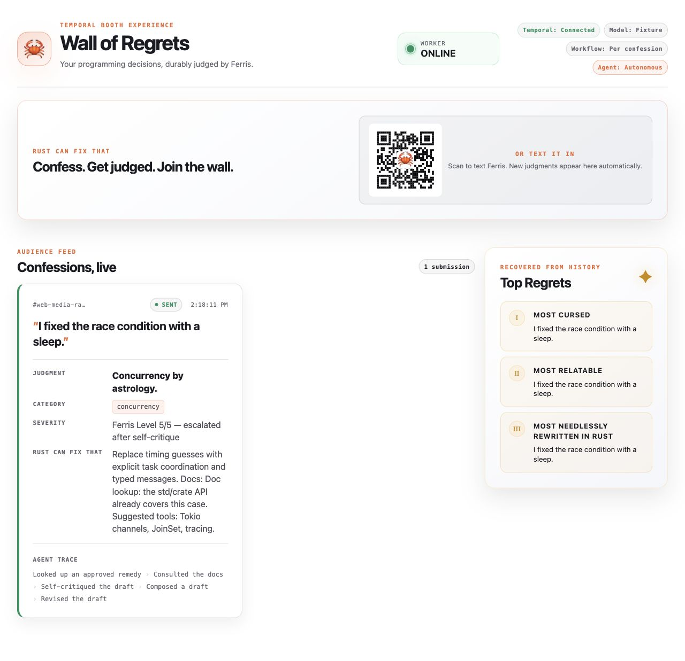
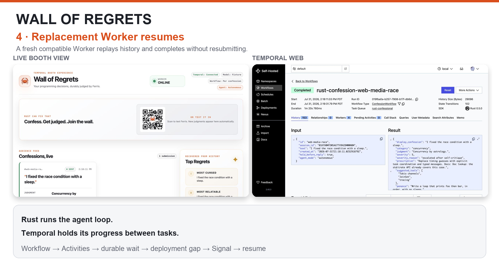

# Wall of Regrets

Wall of Regrets is a stage-friendly Rust and Temporal demo: audience members
submit a programming confession, Ferris plans a response, consults an approved
Rust remedy catalog, and produces a dry but useful judgment. The dashboard makes
every transition visible. Park the Workflow at the human-in-the-loop checkpoint,
begin a routine Worker replacement, release the reply during the deployment gap,
and watch the fresh Worker resume the same agent.



## Deploy-and-resume walkthrough

[](docs/media/wall-of-regrets-walkthrough.mp4)

The 10-second [MP4 walkthrough](docs/media/wall-of-regrets-walkthrough.mp4)
shows the judgment reach `Reply Pending` without occupying an active Worker
slot, the old Worker stop for a deliberately stretched deployment, the durable
`release` Signal arrive during the gap, and a fresh compatible Worker finish the
same Workflow. An [animated preview](docs/media/wall-of-regrets-walkthrough.gif)
is included for Markdown renderers that do not play repository-hosted video.

## Talk recording and slides

[Watch the Wall of Regrets Rust meetup talk on YouTube](https://youtu.be/_t_Rxf8Z4mU?si=bqvJKqz_hZe2OheV).

[Download the "Rust Can Fix That" slide deck (PDF)](docs/media/rust-can-fix-that-slides.pdf).

The talk-sized thesis is:

> Rust runs the agent loop. Temporal holds its progress between tasks.

**Built on the official Temporal Rust SDK** (Public Preview) — if you want to build
durable Rust services yourself, start here:
[`temporalio/sdk-rust`](https://github.com/temporalio/sdk-rust) and the
[Rust SDK docs](https://docs.temporal.io/develop/rust).

This repository is intentionally Docker-first. You do not need Rust, Cargo, or
Temporal installed on the host.

## What is included

- A tiny in-memory `naive` agent for the opening failure contrast
- A Rust/Axum stage server and live browser dashboard
- One Temporal Workflow per confession (production shape), with a dashboard
  toggle to an aggregate per-session mode that makes durable state vivid on stage
- Typed Activities for planning, remedy lookup, composition, projection, and
  delivery
- A deterministic fixture model for rehearsals and offline stage use
- An optional OpenAI Responses API backend with structured JSON output
- Optional Twilio inbound messages, by signed webhook or by outbound-only API
  polling for hosts that cannot expose a public URL
- A safe-by-default stage feed using the agent's display paraphrase, plus an
  explicit trusted-input switch for showing incoming text immediately
- A deliberate `Reply Pending` checkpoint and durable `release` Signal
- A dry, model-written `penance` rendered on the dashboard as a loop that types
  itself out, repeated by severity
- Three reliability beats — durable human wait, Worker replacement, and
  retryable dependency failure — with network partition and hard crash retained
  as optional engineering cases
- Persistent Docker volumes for Temporal history and the dashboard projection
- Three score-based “Hall of Shame” awards, selected only from `Sent` rows
- A passive `?view=wall` **Wall of Regrets** booth layout with no operator controls

Twilio input is inbound-only: audience texts arrive by webhook or API polling,
and the delivery Activity reports back to the stage without sending an SMS reply.

## Quick start

Prerequisites:

- Docker Engine or Docker Desktop with Docker Compose v2
- Loopback ports `3000`, `7233`, and `8233` available
- Network access for the first image pull and Rust dependency build

The native Temporal Rust SDK is in Public Preview; APIs may evolve. Every
`temporalio-*` crate is pinned to `=0.5.0` with `Cargo.lock` committed — treat
upgrades as deliberate replay-compatibility work.

Start in fixture mode, which is the safest mode for a live presentation:

```sh
make up
make status
curl -fsS -o /dev/null http://localhost:3000/healthz
```

Open:

- Stage dashboard: <http://localhost:3000>
- Temporal Web UI: <http://localhost:8233>

The dashboard starts with **Hold before reply** enabled. Submit a confession,
wait for `Reply Pending`, then turn the hold off to finish. While the agent
works, the public card shows a neutral placeholder, replaced by the agent's
`display_confession` once the judgment arrives. Click any card to pin it to the
top so it stays in view as new confessions arrive.

Stop the containers while retaining both named volumes:

```sh
make down
```

See [the demo runbook](docs/DEMO_RUNBOOK.md) for the exact park, deployment-gap,
Signal, and replacement-Worker sequence.

## Opening beat: the naïve agent forgets

The runtime image also ships a deliberately non-durable agent: fixture backend,
one judgment, pending reply held only in process memory. Run it after
`make build` or `make up`.

Terminal A (this command intentionally stays attached):

```sh
make naive-run
```

Wait for:

```text
REPLY PENDING  memory only — replace this container now
Pending confessions in this process: 1
```

Then, in Terminal B:

```sh
make naive-redeploy
```

Terminal A exits cleanly because its in-memory process was replaced. Back in
Terminal A, start the replacement:

```sh
make naive-restart
```

It reports:

```text
Recovered pending confessions: 0
Nothing to resume—the process memory is empty.
```

That is the short opening contrast: an ordinary process replacement loses local
memory. The main demo replaces a Temporal Worker and resumes the same pending
work from durable history.

## Stage feed safety mode

`SHOW_RAW_CONFESSIONS=false` is the default and the recommended setting for a
public event. Stage stores and serves a neutral placeholder followed by the
agent's stage-safe paraphrase. The raw confession still exists in Temporal
history and, in OpenAI mode, is sent to the model provider.

For a rehearsal or a presenter-controlled set of trusted inputs, raw display can
be explicitly enabled:

```sh
export SHOW_RAW_CONFESSIONS=true
docker compose up -d --force-recreate stage
```

In this mode Stage normalizes the text (strips control characters, collapses
whitespace, keeps letters/numbers/punctuation/emoji), blanks any `MASK_WORDS`,
then projects and persists it in the `stage-data` volume instead of using
`display_confession`. Text that is empty after normalization is rejected. No word
list ships here — supply your own via `MASK_WORDS` (comma- or space-separated, in
your git-ignored `.env`). These guards raise the floor but are not moderation:
they miss creative spellings, context, and PII like names or phone numbers. Keep
the Hold toggle and Reset ready as a kill switch, and rehearse with real inputs
before opening to an audience or a public Twilio number.

Stage fails closed if Twilio is configured at the same time as raw display. It
will start only if `ALLOW_UNMODERATED_TWILIO=true` is also explicit. That escape
hatch exists for controlled integration testing, not public events; prefer
disabling Twilio or keeping raw display off.

To return to the safe default and clear the current Stage projection:

```sh
export SHOW_RAW_CONFESSIONS=false
export ALLOW_UNMODERATED_TWILIO=false
docker compose up -d --force-recreate stage
make reset-demo
```

Changing the flag does not scrub rows already persisted. Temporal history retains
raw Workflow input and the plan/compose Activity inputs in either mode; the lookup
Activity gets only the typed plan and delivery only the submission ID, so raw text
is not copied there.

## Model modes

### Fixture mode (recommended on stage)

Fixture mode is the default:

```sh
MODEL_PROVIDER=fixture docker compose up --build -d
```

It classifies by keyword, uses the bundled remedy catalog, and adds short
simulated delays so the pipeline stays visible. Outputs are repeatable and it
makes no network calls — but the Docker image must still be built or pulled
before an offline event.

### OpenAI mode

OpenAI mode makes structured-output requests per confession: one to plan and
one to compose in the linear shape, plus a decide-next-step call each turn (and
a self-critique call when the loop runs that skill) in the autonomous shape.
Supply a model that your account can access. To avoid putting the API key itself
in shell history:

```sh
export MODEL_PROVIDER=openai
read -rsp "OpenAI API key: " OPENAI_API_KEY; export OPENAI_API_KEY; echo
export OPENAI_MODEL="YOUR_MODEL_ID"
docker compose up --build -d
```

The default model is in `compose.yaml`, but set `OPENAI_MODEL` explicitly since
availability varies by account. Requests use the Responses API with strict JSON
schemas, a 12-second HTTP timeout (configurable via `MODEL_TIMEOUT_SECONDS`), and
`store: false`.

To switch an already-running stack back to the fixture backend:

```sh
export MODEL_PROVIDER=fixture
unset OPENAI_API_KEY
docker compose up -d --force-recreate worker
```

This changes future Activity execution; it does not reopen a Workflow that has
already failed after exhausting its retries.

## Autonomous agent loop

Each confession runs one of two agent shapes, chosen by the dashboard's
Linear ↔ Autonomous toggle:

- **Linear** is the fixed pipeline: plan, look up a remedy, compose.
- **Autonomous** (the demo default) hands the agent a bounded decide/act loop.
  On each turn it picks one step — run a skill, compose a draft, revise it once,
  or finish — and the dashboard renders the step trace.

Three skills are approved, and only these three:

- **Remedy lookup** returns guidance from the bundled Rust remedy catalog. The
  catalog, not the model, owns remedies, so suggested tools stay on-brand.
- **Self-critique** reviews the work so far — the confession and the findings
  already gathered — and names one concrete improvement, which the next compose
  folds in.
- **Doc lookup** is a *simulated* web search: it returns a canned,
  realistic-looking result and makes **no live network call**, so the beat is
  deterministic and offline-safe in both backends.

The loop is model-driven in OpenAI mode (the model chooses each step against a
strict JSON schema and runs the real self-critique) and deterministic in fixture
mode (a content-aware policy keyed on the confession's category). Either way the
loop is hard-capped on steps and always terminates with a validated judgment —
on an explicit `finish` in fixture mode, or, if OpenAI reaches the cap first, on
a fallback compose.

Part of that judgment is the **Ferris Level** — a 1–5 severity plus a very short
justification (for example "prod-facing unsafe" or "cosmetic nit"). In OpenAI
mode the model authors both the rating and the reason, and because a revise
re-composes with the findings gathered so far, it can re-rate and re-justify as
it learns more. The dashboard shows it as `Ferris Level N/5 — <reason>`.

## Optional inbound SMS (Twilio)

Both paths below need **your own Twilio account and a Twilio phone number** (a
paid number — inbound SMS is billed per message); plug your own credentials into
the variables shown. The demo ships with no number of its own, and the committed
QR points at a placeholder.

The webhook path is disabled unless all three variables below are set.
`TWILIO_WEBHOOK_URL` must be the exact external URL Twilio invokes (scheme, host,
path, port, query string) — it is part of signature validation. Keep
`SHOW_RAW_CONFESSIONS=false` for a public number.

```sh
export TWILIO_ACCOUNT_SID="AC..."
read -rsp "Twilio auth token: " TWILIO_AUTH_TOKEN; export TWILIO_AUTH_TOKEN; echo
export TWILIO_WEBHOOK_URL="https://YOUR_PUBLIC_HOST/webhooks/twilio/messages"
export SHOW_RAW_CONFESSIONS=false
export ALLOW_UNMODERATED_TWILIO=false
docker compose up -d --force-recreate stage
```

Configure the inbound message webhook for the demo number to send an HTTP
`POST` to the same `TWILIO_WEBHOOK_URL`.

Compose publishes Stage only on loopback. Use a path-restricted HTTPS reverse
proxy that forwards only `/webhooks/twilio/messages` to
`http://127.0.0.1:3000/webhooks/twilio/messages`. Do not use a whole-service
tunnel: it would also expose the unauthenticated hold, seed, and reset controls.

The endpoint requires `application/x-www-form-urlencoded`, validates
`X-Twilio-Signature` and `AccountSid`, and keys submissions on `MessageSid`.
`From`/`To` are validated but never retained or logged. STOP/START/HELP-family
messages are acknowledged without starting Workflows. The response is empty TwiML
— no outbound SMS; results appear on the dashboard, and unsigned requests are
rejected.

### Inbound via API polling (no public URL)

When the host cannot expose a public webhook — a locked-down or work laptop —
Stage can instead **poll** Twilio's REST API. It only makes outbound HTTPS calls
to `api.twilio.com`; nothing listens for Twilio, so there is no tunnel and none
of the exposure the webhook note above warns about.

Polling activates when `TWILIO_NUMBER` is set. Credentials prefer an API key
(Console → Account → API keys & tokens), falling back to the account auth token:

```sh
export TWILIO_ACCOUNT_SID="AC..."
export TWILIO_API_KEY_SID="SK..."
read -rsp "Twilio API key secret: " TWILIO_API_KEY_SECRET; export TWILIO_API_KEY_SECRET; echo
export TWILIO_NUMBER="+15551234567"   # E.164
export TWILIO_POLL_SECONDS=4          # optional, default 4
docker compose up -d --force-recreate stage
```

Leave `TWILIO_WEBHOOK_URL` unset for polling only — the webhook and poller are
independent paths, so setting it starts the webhook *in addition* rather than
switching modes.
The poller baselines the existing message backlog on its first successful fetch
(so texts sent before startup are ignored), deduplicates by `MessageSid`, skips
STOP/START/HELP-family commands, and feeds each new message into the same
submission path as the browser form. This is inbound-only and needs no A2P
registration; the tradeoff is up to `TWILIO_POLL_SECONDS` of latency between a
text being sent and appearing on the dashboard.

### Confession QR code

The dashboard shows a QR that encodes `sms:<number>` — scanning it opens the
audience member's Messages app addressed to the demo number, with a 🦀 in the
centre. The committed `static/confess-qr.svg` uses a **placeholder number on
purpose**: a real number in a public repo attracts spam and per-message charges
(inbound SMS bills you even when the demo is not running) and cannot be removed
from git history. Regenerate it with your own number for a live event, and keep
that copy local:

```sh
pip install segno
python tools/gen_qr.py "+15551234567"        # your Twilio number, E.164
git update-index --skip-worktree static/confess-qr.svg   # never commit the real one
```

`--skip-worktree` tells git to ignore your local edit so the placeholder stays
in the repo. To restore normal tracking (e.g. to update the placeholder), run
`git update-index --no-skip-worktree static/confess-qr.svg`. For a live talk,
put the human-readable number on your slides rather than in the dashboard, which
is why the on-screen caption intentionally omits it.

## Wall of Regrets booth mode

Open <http://localhost:3000/?view=wall> for a passive booth display. The wall
keeps the QR invitation, newest judgments, submission count, and award leaders on
screen while hiding the submission form and all operator controls. Keep the
normal dashboard open in a separate operator-only tab for hold, reset, seed, and
mode controls.


Recommended booth setup:

```sh
export MODEL_PROVIDER=fixture             # reliable offline fallback
export MAX_SUBMISSIONS_PER_SESSION=100    # per-confession mode handles the volume
export SHOW_RAW_CONFESSIONS=false          # never project raw SMS input
docker compose up --build -d
```

Then:

1. Regenerate `static/confess-qr.svg` locally with the event's Twilio number.
2. Keep **Per confession** mode and turn **Hold before reply** off.
3. Put `/?view=wall` full-screen on the public display.
4. Keep `/` on the operator laptop and test the kill switch before doors open.
5. Reset between event days; use `docker compose down -v` only when old Temporal
   history and the Stage projection may be permanently discarded.

The wall view is a presentation layout, not an authorization boundary. Compose
still binds Stage to loopback; expose only the signed Twilio webhook path (or use
outbound polling), never the dashboard or its unauthenticated control endpoints.

## Reliability beats to demo

Lead with the everyday production story: an interaction waits for a person,
Workers are replaced during a deployment, and the interaction continues. This
shows reliability at two layers: **Temporal** retains Workflow history, Signals,
and retry state; **Rust** makes the agent steps and retryable-vs-permanent errors
explicit and compiler-checked. Full speaker cues and fallbacks are in
[docs/DEMO_RUNBOOK.md](docs/DEMO_RUNBOOK.md).

### 1. Park for human input without holding a Worker

Keep replies held and submit or seed confessions. At `Reply Pending`, the
Workflow is open in Temporal but no Workflow code is actively executing and no
Worker thread or task slot is held while it waits for the `release` Signal. The
durable source of truth is the event history, not a suspended Rust process.

“Parked” is presentation shorthand, not a claim that the Workflow consumes zero
resources: Temporal still stores its history, and a Worker may retain replay
state in cache. The important boundary is that waiting does not require a live
process dedicated to that confession.

### 2. Replace the Worker during live work

With confessions still at `Reply Pending`, deliberately stretch a deployment
window across two commands:

```sh
make begin-redeploy
# Turn Hold before reply off while no Worker is polling.
make finish-redeploy
```

`begin-redeploy` stops the old Worker normally. Temporal records the release
Signal during the gap. `finish-redeploy` creates a fresh Worker from the current
image; it replays compatible Workflow history and continues through `Sending`
to `Sent` without resubmitting the confession or rerunning completed agent
steps. The local gap is intentionally visible; real deployments normally
overlap Worker capacity.

This demonstrates **Worker replacement with the same replay-compatible code**.
It does not demonstrate Worker Versioning or make arbitrary Workflow code
changes safe. Production code rollouts still need the SDK's supported
versioning or patching strategy and replay-compatibility testing.

### 3. Transient model failure (rate-limit or downtime)

Submit a confession that mentions rate limiting, for example
"the API keeps rate-limiting my agent" — or just click **⟳ Rate-limit demo**,
which loads that confession for you. The `compose` Activity returns a
*retryable* error on its first two attempts and succeeds on the third, keyed on
the Activity's own attempt counter. The card stays in `Composing` while Temporal
retries with backoff (the attempts are visible in Temporal Web), then recovers
with no operator action. Rust decides the error is retryable; Temporal owns the
backoff and keeps the Workflow durable. This works in both fixture and OpenAI
mode.

### Optional: network partition

```sh
make partition-worker
make heal-worker
```

`partition-worker` disconnects the Worker container from the Compose network, so
the process keeps running but cannot reach Temporal (or Stage). Workflows make no
progress and lose nothing; `heal-worker` reconnects it and Temporal redelivers
the pending Tasks so execution resumes. If a model call is in flight when the
partition hits (OpenAI mode), that Activity times out and simply retries — the
model-backed Activities use unlimited attempts with no total-time cap — so the
loop rides through the outage instead of failing. Keep this as an optional
infrastructure-oriented variation; the deployment story is more universal.

The `make kill-worker` and `make restart-worker` controls remain available for a
hard-crash variation, but they are not the recommended talk path.

## Workflow design and best practices

### How it is built

- **One Workflow per confession.** Each submission starts its own
  `ConfessionWorkflow` with a stable, readable Workflow ID
  (`rust-confession-{submission}`). This is the idiomatic unit of work
  and scales to very large numbers of Workflows.
- **Deterministic orchestration, side effects in Activities.** The Workflow
  decides *what* happens and in what order; every model call, catalog lookup,
  status report, and delivery runs behind an Activity boundary so replay stays
  deterministic.
- **Durable in-process state.** The Workflow folds each result into its own
  state via `ctx.state_mut(...)` (plan, judgment, status, release flag), rebuilt
  by replay after any failure and exposed through the `snapshot` query. It runs
  single-threaded and deterministic, so it needs no locks and has no data races —
  this "one durable object, many calls, no locks" property is the heart of the
  demo.
- **Per-operation timeouts and retries.** Model-backed Activities use
  `durable_activity_options` — a start-to-close timeout, no total-time cap, and
  unlimited retries — so they ride through dependency outages, partitions, and
  Worker replacement; delivery and reporting use bounded budgets
  (`activity_options`). Both live in
  `src/workflows.rs`.

### Best practices worth taking away

- Model the contract between steps as **typed Rust values**, not loose strings.
- Give every side effect an **explicit timeout and retry budget**, and mark
  permanent failures non-retryable so they fail fast.
- Treat external effects as **at-least-once** and deduplicate (delivery is capped
  at one attempt until it dedupes by submission ID).
- Prefer **one Workflow per unit of work** — Temporal scales by running many
  Workflows, not by cramming requests into one. Consolidate into a
  per-entity/window/region Workflow only when the domain needs aggregation,
  ordering, windowing, or rate-limiting. A single long-lived Workflow ingesting
  everything also needs continue-as-new for history growth, and is where the
  preview Rust SDK is thinnest.
- Pin **SDK versions** and treat upgrades as deliberate replay-compatibility
  work; use **stable Workflow IDs** and **durable Signals**.

### Production vs demo: the workflow-mode toggle

The dashboard has an **Aggregate workflow** switch (and `POST /api/demo/mode`)
that flips between the two shapes so you can show the difference live:

- **Per confession (default, production):** one `ConfessionWorkflow` per
  submission. In Temporal Web you see one Workflow per confession — the shape you
  would ship.
- **Aggregate (demo):** one long-lived `SessionWorkflow` for the whole session.
  Every confession arrives by Signal and is folded into that single Workflow's
  durable state via `state_mut`, so the entire board is one durable object you
  can inspect with its `snapshot` query. In Temporal Web you see exactly one
  Workflow.

Both modes run the same Activities and report to the same dashboard; only the
Workflow granularity differs. Switching modes resets the session so the two never
interleave. Use the aggregate mode to make durable state vivid on stage; keep the
per-confession mode as the production reference.

See [docs/ARCHITECTURE.md](docs/ARCHITECTURE.md) for the full design.

## Useful commands

| Command | Purpose |
| --- | --- |
| `make up` | Build and start Temporal, Stage, and Worker in the background |
| `make down` | Stop the stack; retain named volumes |
| `make build` | Build the Docker application image |
| `make test` | Run `cargo test --locked` in the Docker test target |
| `make lint` | Run formatting checks and Clippy with warnings denied |
| `make logs` | Follow Stage and Worker logs |
| `make status` | Show Compose service state |
| `make naive-run` | Run the blocking, in-memory fixture agent in a temporary container |
| `make naive-redeploy` | Stop the in-memory agent as a routine process replacement |
| `make naive-forget` | Backwards-compatible alias for `make naive-redeploy` |
| `make naive-restart` | Start a fresh naïve process and show that zero items recover |
| `make begin-redeploy` | Stop the old Worker and open the visible deployment gap |
| `make finish-redeploy` | Create the compatible replacement Worker |
| `make kill-worker` | Optional hard-crash variation: send `SIGKILL` to the Worker |
| `make restart-worker` | Restart a Worker stopped by the hard-crash variation |
| `make partition-worker` | Disconnect the Worker from the Compose network (simulate a network partition) |
| `make heal-worker` | Reconnect the Worker to the Compose network |
| `make reset-demo` | Pause admissions, release unfinished Workflows, wait up to 12 seconds, then start a fresh session |

For a completely clean rehearsal, including deleting both named volumes:

```sh
docker compose down -v
docker compose up --build -d
```

`down -v` permanently deletes local demo history and dashboard state. A normal
`make down` does not.

## Services and ports

| Service | Host address | Purpose |
| --- | --- | --- |
| Stage | `127.0.0.1:3000` | Dashboard, demo API, health check |
| Temporal | `127.0.0.1:7233` | Temporal gRPC endpoint |
| Temporal Web | `127.0.0.1:8233` | Workflow inspection UI |

Inside Compose, the Worker calls the Stage at
`http://stage:3000/api/internal` and both Rust processes reach Temporal at
`http://temporal:7233`.

## API quick reference

The browser uses these unauthenticated demo endpoints:

```text
GET  /healthz
GET  /api/state
POST /api/confessions       {"text":"I fixed the race with a sleep."}
POST /api/demo/hold         {"held":true}
POST /api/demo/mode         {"mode":"session"}   or {"mode":"per_confession"}
POST /api/demo/agent-mode   {"agent_mode":"autonomous"} or {"agent_mode":"linear"}
POST /api/demo/seed
POST /api/demo/reset
POST /webhooks/twilio/messages   signed Twilio form; optional
```

`POST /api/confessions` also accepts an optional `Idempotency-Key` header for a
stable browser-source submission identity.

The `/api/internal/*` endpoints require the shared bearer token configured for
Stage and Worker. Compose binds all host ports to loopback, but the stage
controls themselves do not require authentication; do not republish port `3000`
directly to a LAN or the internet.

## Data and privacy

Treat submissions as public conference content, not secrets:

- Full confession text is stored in Temporal Workflow history. With the default
  `SHOW_RAW_CONFESSIONS=false`, the Stage projection stores a placeholder
  followed by the agent-produced `display_confession`, not the raw submission.
  With `true`, normalized raw text is served by `/api/state` and persisted in the
  `stage-data` volume.
- OpenAI mode sends confession text and agent context to the configured model
  provider.
- The Twilio webhook path receives sender and recipient fields for
  signature/request validation; the polling path never receives the sender
  number at all. Either way, only a MessageSid-derived identity and the
  confession are retained — no phone numbers in Stage or Workflow state.
- Anyone who can reach the dashboard can view submissions and use its controls.
- A model-produced stage-safe field reduces accidental projection of raw input;
  it is not a substitute for human moderation or an enforceable content policy.
- Raw mode is reported as `show_raw_confessions` in `/api/state`. It is a status
  flag, not an access-control mechanism.
- Temporal Web can expose raw Workflow and model-Activity payloads even when the
  dashboard is in safe mode. Do not inspect arbitrary audience payloads on the
  projector.
- The demo has a 500-character input limit (`MAX_CONFESSION_CHARS`) and a default
  cap of 20 submissions per session (`MAX_SUBMISSIONS_PER_SESSION`), but no
  identity, authentication, per-client rate limiting, moderation queue, or
  deletion workflow.
- Docker container environment variables are visible to sufficiently privileged
  local users. Use a secrets manager for a real deployment.
- Never commit an API key. If you choose to use a `.env` file locally, add it to
  `.gitignore` before creating it and verify the staged changes before pushing.

Private repository visibility is not a substitute for those controls.

## Repository map

```text
src/bin/stage.rs    HTTP server and dashboard process entry point
src/bin/worker.rs   Temporal Worker process entry point
src/bin/naive.rs    deliberately non-durable opening contrast
src/stage.rs        API, projection store, Workflow start, and release Signal
src/workflows.rs    deterministic durable agent orchestration
src/activities.rs   model/tool/report/delivery side effects
src/agent.rs        fixture and OpenAI agent backends
src/domain.rs       shared serializable domain types
src/twilio.rs       Twilio form parsing, signature checks, and keywords
src/twilio_poll.rs  outbound-only polling of Twilio for inbound messages
src/temporal.rs     Temporal client and Workflow start/Signal helpers
src/moderation.rs   stage-safe sanitizing and word masking for raw display
src/config.rs       environment-driven configuration
src/lib.rs          module wiring and shared exports
static/             stage dashboard
tools/gen_qr.py     regenerate the confession QR for your own number
compose.yaml        three-service local stack
```

For design boundaries, failure behavior, and production gaps, read
[docs/ARCHITECTURE.md](docs/ARCHITECTURE.md).

## Acknowledgments

Built with help from Melissa Herrera, Spencer Judge, Chris Olszewski, Tom
Wheeler, and Shy.
