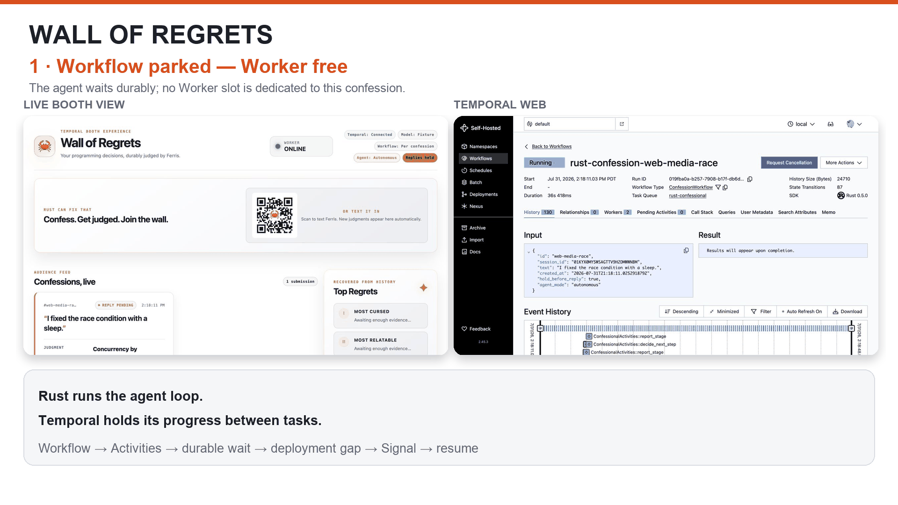
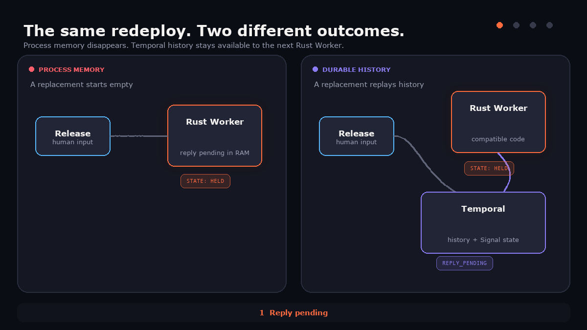
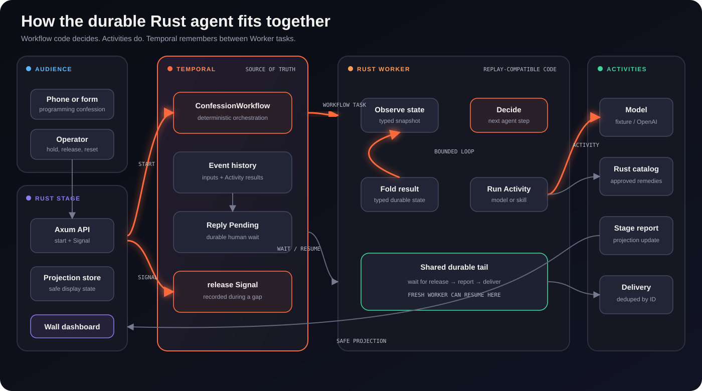

<div align="center">

[](Cargo.toml)
[](https://github.com/temporalio/sdk-rust)
[](compose.yaml)
[](LICENSE)
[](https://youtu.be/_t_Rxf8Z4mU?si=bqvJKqz_hZe2OheV)

</div>

# Rust Confessional

**An audience-powered AI agent built in Rust that keeps its place while Workers
come and go.**

Attendees submit programming sins from a phone or browser. Ferris plans a
response, consults an approved Rust remedy catalog, and returns a judgment,
prescription, and penance. The agent loop runs in Rust. Temporal keeps the
interaction durable through human waits, retries, and Worker redeploys.

The talk and repository are **Rust Confessional**. **Wall of Regrets** is its
passive booth display mode.

> **See it in action:** Watch the
> [Rust meetup talk](https://youtu.be/_t_Rxf8Z4mU?si=bqvJKqz_hZe2OheV), play the
> [10-second deploy-and-resume walkthrough](docs/media/wall-of-regrets-walkthrough.mp4),
> or [download the slide deck](docs/media/rust-can-fix-that-slides.pdf).



## What happens

| Beat | What the audience sees | What the system does |
| --- | --- | --- |
| **Confess** | Someone submits a programming decision | Stage starts one typed Workflow |
| **Ferris judges** | The card moves through planning, lookup, critique, and composition | A bounded Rust loop calls model and tool Activities |
| **Park** | The card stops at `Reply Pending` | The Workflow waits durably without occupying a Worker task |
| **Redeploy and release** | The Worker goes offline, the operator releases the reply, and a fresh Worker finishes it | Temporal records the Signal, replays history, and resumes the same interaction |

## What this demo proves

- The agent loop can remain ordinary, bounded Rust code.
- A human wait does not need a dedicated live process.
- A Signal sent between Worker deployments is not lost.
- A compatible replacement Worker can reconstruct typed state from history.
- Completed model and tool Activities are not rerun just to rebuild progress.

## Why Rust + Temporal?

| Concern | Rust provides | Temporal provides |
| --- | --- | --- |
| **Agent logic** | Enums, structs, exhaustive matching, and a bounded async loop | Durable Workflow execution and replay |
| **Side effects** | Typed Activity inputs, outputs, and error categories | Timeouts, retries, and recorded results |
| **Human input** | A typed release command | A durable Signal that can arrive with no Worker polling |
| **Process lifecycle** | A replaceable Worker binary | Progress that outlives that Worker process |

Rust makes the agent's decisions and boundaries explicit. Temporal makes those
decisions recoverable. Neither replaces the other.

## The durability story

> **Process-only agent:** pending work lives in RAM. Replace the process and the
> replacement starts empty.
>
> **Durable Rust agent:** Workflow state and Signals live in Temporal history.
> A compatible replacement Worker replays that history and continues.



The animation follows the confession, "I fixed the race condition with a
sleep," through the live demo beat. Ferris parks the judgment, the Rust Worker
is redeployed, and the operator releases the reply during the gap. The
process-only agent has nothing to resume. The Temporal-backed Rust agent
replays Ferris's state and sends the judgment with a Rust prescription.

### The loop is ordinary Rust

The production code lives in
[`src/workflows.rs`](src/workflows.rs). This condensed sketch shows the
bounded decide-and-act loop:

```rust
for iteration in 0..MAX_AGENT_STEPS {
    let step = ctx
        .start_activity(
            ConfessionalActivities::decide_next_step,
            decide_input(iteration),
            durable_activity_options(30),
        )
        .await?;

    match step {
        AgentStep::Lookup { skill, .. } => run_skill(ctx, skill).await?,
        AgentStep::Compose | AgentStep::Revise { .. } => compose(ctx).await?,
        AgentStep::Finish => break,
    }
}

ctx.wait_condition(|state| state.released).await;
deliver(ctx).await?;
```

The model may choose the next approved step, but it cannot invent arbitrary
tools or run forever. Model calls, catalog lookup, projection updates, and
delivery all sit behind typed Activity boundaries.

### The durable boundaries



| Boundary | Owns | Why it matters |
| --- | --- | --- |
| **Workflow** | Deterministic decisions, status, findings, judgment, and release state | Replay reconstructs the same durable object |
| **Activity** | Model calls, catalog lookup, projection updates, and delivery | Side effects receive timeouts, retries, and typed errors |
| **Signal** | Human input that may arrive at any time | Input is recorded even when no Worker is available |

The Rust Worker is compute, not the source of truth. Read the
[architecture guide](docs/ARCHITECTURE.md) for the complete lifecycle, retry
policies, trust boundaries, and production gaps.

## Run it in 60 seconds

The repository is Docker-first. You do not need Rust, Cargo, or a Temporal
server installed on the host.

Prerequisites are Docker Engine or Docker Desktop with Compose v2, loopback
ports `3000`, `7233`, and `8233`, and network access for the first build.

```sh
make up
make status
curl -fsS -o /dev/null http://localhost:3000/healthz
```

Open:

| URL | Purpose |
| --- | --- |
| <http://localhost:3000> | Rust Confessional dashboard and controls |
| <http://localhost:8233> | Temporal Web and Workflow history |
| <http://localhost:3000/?view=wall> | Passive Wall of Regrets display |

The deterministic fixture model is the safe default. Stop the stack while
retaining its named volumes with:

```sh
make down
```

## Reproduce the Worker handoff

The dashboard starts in autonomous, per-confession mode with **Hold before
reply** enabled.

1. Submit a confession and wait for `Reply Pending`.
2. Stop the old Worker and leave a visible deployment gap:

   ```sh
   make begin-redeploy
   ```

3. Turn **Hold before reply** off while no Worker is polling. Temporal records
   the durable release Signal.
4. Start a fresh compatible Worker:

   ```sh
   make finish-redeploy
   ```

The replacement replays Workflow history, sees the Signal, and continues
through `Sending` to `Sent`. The confession is not resubmitted and completed
Activities are not rerun.

The [demo runbook](docs/DEMO_RUNBOOK.md) contains presenter cues, the
process-memory opening, event-day preparation, pacing, and fallback paths.

## Choose a demo mode

| Control | Default | Use it to show |
| --- | --- | --- |
| **Autonomous agent** | On | A bounded model-driven decide, act, observe loop |
| **Linear agent** | Off | A fixed lookup and compose pipeline |
| **Per confession** | On | One production-shaped Workflow per submission |
| **Aggregate workflow** | Off | One session object for a stage visualization |
| **Hold before reply** | On | A durable human-in-the-loop checkpoint |
| **Fixture model** | On | Repeatable behavior with no model-provider calls |
| **Show raw confessions** | Off | Stage-safe paraphrases instead of raw audience text |

Fixture mode is recommended for talks and booths:

```sh
MODEL_PROVIDER=fixture docker compose up --build -d
```

OpenAI mode uses structured model calls for planning, deciding, and composing:

```sh
export MODEL_PROVIDER=openai
read -rsp "OpenAI API key: " OPENAI_API_KEY
export OPENAI_API_KEY
export OPENAI_MODEL="YOUR_MODEL_ID"
docker compose up --build -d
```

Requests use strict JSON schemas, a configurable HTTP timeout, and
`store: false`. See [Agent design](docs/ARCHITECTURE.md#agent-design) for the
fixture and OpenAI boundaries.

## Booth mode: Wall of Regrets

The wall view turns the same backend into a passive conference display with new
judgments and Hall of Shame awards.


```sh
export MODEL_PROVIDER=fixture
export MAX_SUBMISSIONS_PER_SESSION=100
export SHOW_RAW_CONFESSIONS=false
docker compose up --build -d
```

1. Keep **Per confession** enabled.
2. Turn **Hold before reply** off.
3. Put `/?view=wall` full-screen on the public display.
4. Keep `/` open on the operator laptop.

Audience SMS is optional and inbound-only. Use the
[Twilio input guide](docs/TWILIO.md) for signed webhook setup, outbound polling,
the local QR workflow, and public-event safeguards.

> **Public-event safety:** Raw confession text still exists in Temporal
> Workflow history. The wall-safe projection is a presentation guard, not a
> moderation system. Do not open arbitrary audience payloads in Temporal Web,
> expose the dashboard controls publicly, or commit credentials and live phone
> numbers. See [Data and privacy implications](docs/ARCHITECTURE.md#data-and-privacy-implications).

## Project guide

| Document | Use it for |
| --- | --- |
| [Architecture](docs/ARCHITECTURE.md) | Workflow lifecycle, Activity policies, data boundaries, and production gaps |
| [Demo runbook](docs/DEMO_RUNBOOK.md) | Rehearsal, presenter cues, pacing, direct controls, and fallbacks |
| [Twilio input](docs/TWILIO.md) | SMS setup, QR generation, exposure boundaries, and event checklist |

### Useful commands

| Command | Purpose |
| --- | --- |
| `make up` | Build and start Temporal, Stage, and Worker |
| `make down` | Stop the stack and retain named volumes |
| `make test` | Run the locked Rust test suite in Docker |
| `make lint` | Run formatting and Clippy with warnings denied |
| `make logs` | Follow Stage and Worker logs |
| `make reset-demo` | Release unfinished Workflows and start a fresh session |
| `make begin-redeploy` | Stop the old Worker and open the demo gap |
| `make finish-redeploy` | Start the compatible replacement Worker |

### Repository map

```text
src/bin/stage.rs    Rust/Axum stage server
src/bin/worker.rs   Temporal Worker process
src/bin/naive.rs    deliberately non-durable opening contrast
src/workflows.rs    deterministic durable agent orchestration
src/activities.rs   model, tool, report, and delivery side effects
src/agent.rs        fixture and OpenAI agent backends
src/domain.rs       shared serializable domain types
static/             dashboard and placeholder QR
docs/               architecture, runbook, and integration guides
tools/              QR and README diagram generators
compose.yaml        local Temporal, Stage, and Worker stack
```

### Regenerate the diagrams

```sh
python3 -m pip install Pillow
python3 tools/render_readme_diagrams.py
```

The generated SVG and GIF are committed so GitHub renders the README without a
build step.

## Talk and project materials

- [Rust meetup recording](https://youtu.be/_t_Rxf8Z4mU?si=bqvJKqz_hZe2OheV)
- ["Rust Can Fix That" slide deck](docs/media/rust-can-fix-that-slides.pdf)
- [Deploy-and-resume MP4](docs/media/wall-of-regrets-walkthrough.mp4)
- [Booth deployment poster](docs/media/wall-of-regrets-deploy-poster.png)

## Acknowledgments

- Built with the [Temporal Rust SDK](https://github.com/temporalio/sdk-rust)
- Ferris is the unofficial Rust mascot

## License

This project is available under the [MIT License](LICENSE).

## Watch the talk

<div align="center">

[](https://youtu.be/_t_Rxf8Z4mU?si=bqvJKqz_hZe2OheV)

*Rust Confessional: watch the full meetup talk on YouTube.*

</div>
