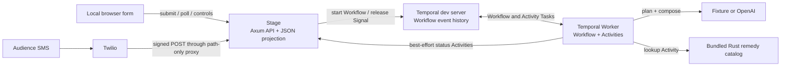

# Architecture

Rust Confessional is a small durable-agent reference demo, not a production
service. It separates deterministic orchestration from non-deterministic work
and makes the Worker process safe to kill at a controlled point.

## Opening contrast: the naïve binary

The runtime image contains three Rust binaries:

| Binary | Role | Durable state |
| --- | --- | --- |
| `naive` | Deliberately non-durable fixture agent used for the opening beat | None |
| `stage` | HTTP API, dashboard, projection, and Temporal Client | Stage JSON projection only |
| `worker` | Temporal Workflow and Activity execution | None in the process; progress lives in Temporal |

`make naive-run` starts a temporary container with one known-safe confession.
After composing, it stores the pending judgment only in a local in-memory array
and blocks. `make naive-forget` sends `SIGKILL` to that container.
`make naive-restart` starts a fresh process without input, which reports zero
recovered items and nothing to resume.

The naïve binary never calls Stage or Temporal. It exists solely to establish
the failure that the durable architecture fixes; it is intentionally excluded
from the service diagram below.

## System view



Stage, Worker, and the naïve contrast are separate Rust binaries in the same
image. Compose runs Stage and Worker as services alongside a single-node
Temporal development server; the naïve binary runs only through its Make targets.

## Submission lifecycle

1. The browser posts up to 500 characters to `POST /api/confessions`, or the
   optional Twilio integration supplies a signed inbound message body.
2. Stage trims and validates the text, chooses a submission ID and session ID,
   and starts a Workflow with the raw text. Its JSON projection receives either
   a neutral placeholder (the default) or normalized incoming text when the
   trusted-input display switch is enabled.
3. Browser input normally gets a ULID. Twilio input derives a stable ID from
   `MessageSid`. The resulting Workflow ID is readable and deterministic:
   `rust-confession-{session_id}-{submission_id}`.
4. A Worker polls the `rust-confessional` task queue.
5. The Workflow runs the `plan` Activity using either the fixture or OpenAI
   backend.
6. If the plan requests it, the `lookup_remedy` Activity reads the bundled,
   approved catalog. No live crate or documentation search is performed.
7. The `compose` Activity returns a typed, validated `Judgment`, including a
   stage-safe `display_confession`, a playful `penance` plus a short
   `penance_line` (rendered on the dashboard as a loop repeated `severity`
   times), and the three award scores. In safe mode, Stage replaces the
   placeholder with the display value. In raw-display mode, it deliberately keeps
   the sanitized incoming text.
8. The Workflow records `ReplyPending` and waits if the submission was created
   while the global hold was enabled.
9. Stage turning the hold off sends an idempotently identified `release` Signal
   to every current unfinished Workflow.
10. The Workflow runs the delivery Activity and finishes at `Sent`. Only then is
    its score eligible for the dashboard awards.

The current delivery Activity is a simulated stage channel: it pauses briefly
and returns a receipt. It does not send SMS, email, or a browser push. The
subsequent projection update is what makes `Sent` visible on the dashboard.

## The durable boundary

The central rule is simple:

- **Workflow code decides what happens and in what order.** It must remain
  deterministic because Temporal may replay it.
- **Activity code interacts with the outside world.** Model requests, sleeps,
  catalog access, HTTP reporting, and delivery live behind Activity boundaries.

The Workflow's durable state includes:

- the original `SubmissionInput`
- current `SubmissionStatus`
- optional `AgentPlan`
- optional `Judgment`
- whether the release Signal has been observed

Temporal reconstructs that state from event history after a Worker crash. The
Worker itself does not persist agent progress.

| Concern | Owner | Durable? | Notes |
| --- | --- | --- | --- |
| Workflow event history | Temporal | Yes, in the demo volume | Authoritative agent progress |
| Submission, plan, judgment, release flag | Workflow state | Yes, via history | Rebuilt by replay |
| Dashboard rows and hold setting | Stage JSON store | Yes, in a separate volume | Safe display by default; raw when explicitly enabled |
| Worker heartbeat | Stage memory | No | Online if seen in the last three seconds |
| Model client and Activity execution | Worker memory | No | Recreated on Worker restart |
| Browser rendering | Browser memory | No | Rebuilt by polling `/api/state` |

The dashboard projection is intentionally non-authoritative. Workflow status is
reported through Activities, and reporting failure is ignored after its retry
policy is exhausted so a broken projector cannot fail the durable agent.

Raw payloads are also narrowed at Activity boundaries. The Workflow and the two
model Activities require the confession, but unrelated steps do not:

| Operation | Payload includes raw confession? |
| --- | --- |
| Workflow input/state | Yes |
| `plan` Activity | Yes |
| `compose` Activity | Yes |
| `lookup_remedy` Activity | No; it receives the typed plan only |
| `deliver` Activity | No; it receives the submission ID only |
| Stage status Activity | No; it receives status and structured judgment |

This avoids redundant raw copies in lookup and delivery events. It does not make
Temporal Web safe for arbitrary live inspection: Workflow, plan, and compose
payloads still contain the original text.

## Workflow interface

`ConfessionWorkflow` exposes:

- `run(SubmissionInput) -> Judgment`: the main orchestration
- `release(ReleaseInput)`: a Signal that sets the durable release flag
- `snapshot() -> WorkflowSnapshot`: a Query containing state, plan, judgment,
  and release status

Stage uses the start and Signal operations. The snapshot Query is defined for
inspection and future tooling but the current dashboard reads its local
projection rather than querying each Workflow.

The release Signal includes a request ID derived from the submission ID. This
lets the client identify duplicate signal requests consistently.

### Aggregate variant: `SessionWorkflow`

A second Workflow type exists for the stage demo, selected by the `workflow_mode`
toggle (`POST /api/demo/mode`). `SessionWorkflow` is one long-lived execution per
session; confessions arrive through an `add_confession` Signal, are queued, and
are processed one at a time, each folded into a single durable state via
`state_mut`. It shares the same Activities and the same `release` Signal, exposes
a `snapshot() -> SessionSnapshot` Query over the whole board, and isolates
per-item failures so one bad confession does not fail the session.

The default and production shape is one `ConfessionWorkflow` per confession;
`SessionWorkflow` exists to make durable state visible on stage (one Workflow in
Temporal Web, one object holding everything). Switching modes resets the session
so the two never interleave. A single long-lived Workflow like this would need
continue-as-new for history growth beyond a demo session.

## Activity policies

Each side effect has an explicit timeout and retry budget:

| Activity type | Start-to-close | Schedule-to-close | Maximum attempts |
| --- | ---: | ---: | ---: |
| Model (`plan`, `compose`) | 20 s | 75 s | 3 |
| Tool (`lookup_remedy`) | 5 s | 15 s | 3 |
| Projection (`report_stage`) | 5 s | 12 s | 2 |
| Delivery (`deliver`) | 10 s | 30 s | 1 |

The OpenAI HTTP client also has a configurable timeout, 12 seconds by default.
Retryable transport, throttling, and server errors become retryable Activity
failures. Authentication, schema, refusal, and other permanent errors are marked
non-retryable.

Delivery is deliberately limited to one attempt because external side effects
are normally at-least-once. A production adapter must atomically deduplicate on
`submission.id` (or use a transactional outbox) before increasing retries.

## Agent design

The agent is a bounded two-model-call loop rather than an open-ended autonomous
loop:

```text
Submission
  -> plan: category, lookup decision, search key
  -> optional approved remedy lookup
  -> compose: judgment, severity, prescription, tools, penance, award scores
  -> controlled release checkpoint
  -> delivery
```

This shape keeps the Temporal history, runtime, and on-stage explanation small.
The planner and composer communicate through serializable Rust types rather
than unstructured strings.

### Fixture backend

The fixture classifies by keywords, always requests the local catalog, and
generates stable canned language plus deterministic award scoring. Short sleeps
make pipeline transitions visible. It is the intended rehearsal and conference
fallback.

### OpenAI backend

The OpenAI implementation uses the Responses API for both calls. It:

- treats the confession as quoted, untrusted data in the prompt
- requests strict JSON-schema output
- deserializes directly into the shared Rust domain types
- validates severity, award ranges, `display_confession`, and required text
- sends `store: false`
- records provider request IDs in logs without logging the API key

The approved remedy remains local even in OpenAI mode; the model decides whether
the Workflow should consult it.

## Optional Twilio inbound boundary

Twilio ingress is disabled unless `TWILIO_ACCOUNT_SID`, `TWILIO_AUTH_TOKEN`, and
`TWILIO_WEBHOOK_URL` are all non-empty. Partial configuration fails Stage
startup. The configured URL must exactly match the public request URL because it
is used as signature input.

`POST /webhooks/twilio/messages`:

- accepts only `application/x-www-form-urlencoded`
- validates `X-Twilio-Signature` with the configured auth token
- checks the form's `AccountSid` against configuration
- requires `MessageSid`, `Body`, `From`, and `To`
- derives the submission identity from `MessageSid`, so source retries target
  the same Stage row and Workflow ID
- validates but does not retain or log `From` and `To`
- recognizes STOP/START/HELP-family compliance keywords and does not turn them
  into confessions
- returns empty TwiML and never sends an outbound SMS

Signature calculation includes all submitted field pairs, including duplicate
names. The Stage is loopback-only in Compose, so a real Twilio request needs an
HTTPS reverse proxy. That proxy should publish only the webhook path; the
dashboard and operator endpoints must remain private.

## Dashboard and projection

The browser polls `GET /api/state` every 700 milliseconds and renders with DOM
`textContent`, so submissions are not inserted as HTML. Stage atomically writes
its projection by writing a temporary JSON file and renaming it over the data
path.

`SHOW_RAW_CONFESSIONS=false` is the default. The projection then contains a
neutral placeholder followed by the agent's stage-safe display confession, plus
Workflow IDs, visible results, award scores, and the session-wide hold flag.

When `SHOW_RAW_CONFESSIONS=true`, Stage removes control characters and collapses
whitespace (keeping letters, numbers, punctuation, and emoji), blanks any words
listed in the optional `MASK_WORDS` environment variable, rejects messages that
are empty once control characters are removed, then immediately persists and
serves that result and keeps it when the judgment arrives. No word list is
bundled in the repository; operators supply their own via `MASK_WORDS`. This
raises the floor for projecting audience text; it is not human moderation and
cannot catch creative spellings, context, or personal information. The guard
logic lives in `src/moderation.rs` with unit tests. Returning the flag to `false`
does not scrub raw rows already stored in the `stage-data` volume.

The public state includes `show_raw_confessions` as a status flag. Configuration
also fails closed: if Twilio is configured with raw mode, Stage refuses to start
unless
`ALLOW_UNMODERATED_TWILIO=true` is explicitly set. The override is intended only
for controlled integration testing and does not add moderation or access
control.

Awards select the highest-scoring `Sent` submission in each category; pending,
sending, and failed rows are excluded. There is no vote or final model call.
This keeps winners hidden at the crash checkpoint and reveals them only after
recovery.

The fixture backend preserves the small set of bundled, pre-approved example
sentences and replaces unknown input with a category-level summary. The OpenAI
backend is instructed to produce conference-safe text. That generated field is
a useful presentation guard, not a security or moderation boundary.

There are two distinct status indicators:

- **Worker online** is based on the Worker's HTTP heartbeat and changes to
  offline after three seconds.
- **Temporal connected** reflects the Stage client's known connection state. It
  is a useful demo indicator, not a comprehensive Temporal health check.

If Stage is unavailable, Workflows can continue, because status reporting is
best-effort. When Stage returns, its JSON file is restored, but it does not
rebuild missed projection changes by scanning Temporal history. Production
systems need a repairable projection path.

## Storage and reset behavior

Compose defines two named volumes:

- `temporal-home` stores the development server's SQLite database at
  `/home/temporal/temporal.db`.
- `stage-data` stores the dashboard JSON file at `/app/data/stage.json`.

`docker compose down` retains both volumes. `docker compose down -v` deletes
both.

The dashboard reset endpoint releases current unfinished Workflows and waits up
to 12 seconds for all current rows to become `Sent` or `Failed`. It replaces
Stage state with a new session only after that drain succeeds. A failed Signal,
an unavailable Worker, or a timeout preserves the current session and returns
an error so waiting Workflows are not silently orphaned. Reset does not delete
Temporal history. Stage holds its admission lock throughout, preventing new
browser, seed, hold, or Twilio work from interleaving with the old-session drain.

## Network and trust boundaries

| Path | Exposure in Compose | Protection |
| --- | --- | --- |
| Stage `:3000` | Published at `127.0.0.1:3000` | Demo routes have no auth |
| Temporal gRPC `:7233` | Published at `127.0.0.1:7233` | Dev server; no production security posture |
| Temporal Web `:8233` | Published at `127.0.0.1:8233` | No demo authentication |
| Twilio → webhook | Optional path-restricted public proxy | Twilio signature plus AccountSid check |
| Worker → Stage internal API | Compose network and published Stage port | Shared bearer token |
| Worker → OpenAI | Outbound internet in OpenAI mode | API key bearer token |

The internal bearer token in `compose.yaml` is a fixed demo value. The Stage
port is loopback-only by default, and internal routes additionally require that
token. Rotate and manage it as a secret in any shared environment.

## Data and privacy implications

With the safe Stage default, raw submission text crosses a smaller boundary than
the public UI suggests:

1. Temporal event history as Workflow input and as plan/compose Activity input
2. Worker memory while the plan and compose Activities execute
3. OpenAI requests when that backend is enabled

For Twilio input, `From` and `To` are present transiently while the signed form
is validated, but are not copied into Stage or Workflow state. A
`MessageSid`-derived identifier is persisted with the submission.

With `SHOW_RAW_CONFESSIONS=false`, the Stage volume and `/api/state` receive a
placeholder followed by the agent-produced `display_confession`, not that raw
input. With `true`, they receive and retain normalized raw text. Derived output
may still reveal or mishandle content in safe mode, especially with a model, so
the paraphrase is not equivalent to human moderation.

Temporal Web is outside the Stage projection guard in both modes. A live speaker
should inspect only preselected seeded or speaker-owned Workflow events, never
click through arbitrary audience payloads on the projector.

The demo provides no per-user isolation, consent record, retention policy,
moderation queue, access control, or deletion propagation across its stores.
The `store: false` model request flag does not remove the application's own
Temporal copy. Do not solicit credentials, personal data, proprietary code,
incident details, or anything that should not be sent to the configured
services.

## Demo choices versus production requirements

| Demo implementation | Production direction |
| --- | --- |
| Native Temporal Rust SDK `0.5.0` in Public Preview, with every `temporalio-*` crate pinned to `=0.5.0` | Track SDK maturity and test intentional upgrades for API and replay compatibility |
| Single-node Temporal development server with SQLite | Supported Temporal deployment or Temporal Cloud, with retention and backup policy |
| Local named volumes | Encrypted, monitored, backed-up storage with tested recovery |
| JSON file dashboard projection | Durable database/read model with reconciliation from Workflow state or events |
| Browser form and unauthenticated operator controls | Authenticated ingress, abuse controls, CSRF protection, TLS, and separate operator controls |
| Signed Twilio inbound webhook, but simulated delivery | Consent and retention controls plus an idempotent outbound adapter and delivery receipts |
| Fixed internal bearer token | Secret manager, rotation, and service identity |
| Bundled static remedy catalog | Versioned approved sources, provenance, caching, and policy enforcement |
| Minimal prompt safety instruction | Moderation, output policy, redaction, and adversarial testing |
| Safe display by default plus operator-enabled raw feed | Human/operator review and enforceable per-source projection policy |
| Best-effort projection with no repair | Observable projection pipeline, dead-letter handling, and replay/reconciliation |
| One Workflow per submission with a global 20-item session cap | Per-client rate limits, quotas, concurrency controls, and capacity planning |
| Best-effort failure status Activity | Durable/reconcilable failure projection and operator recovery workflows |

Practices worth retaining from the demo include typed contracts, deterministic
Workflow code, explicit Activity boundaries, operation-specific timeouts and
retries, structured model output validation, durable Signals, stable Workflow
IDs, pinned Temporal SDK crate versions, and a delivery idempotency key.

Before a real rollout, also define Workflow versioning and replay tests,
observability and alerting, namespace and task-queue ownership, data retention
and deletion, model cost budgets, and a secret rotation procedure.
